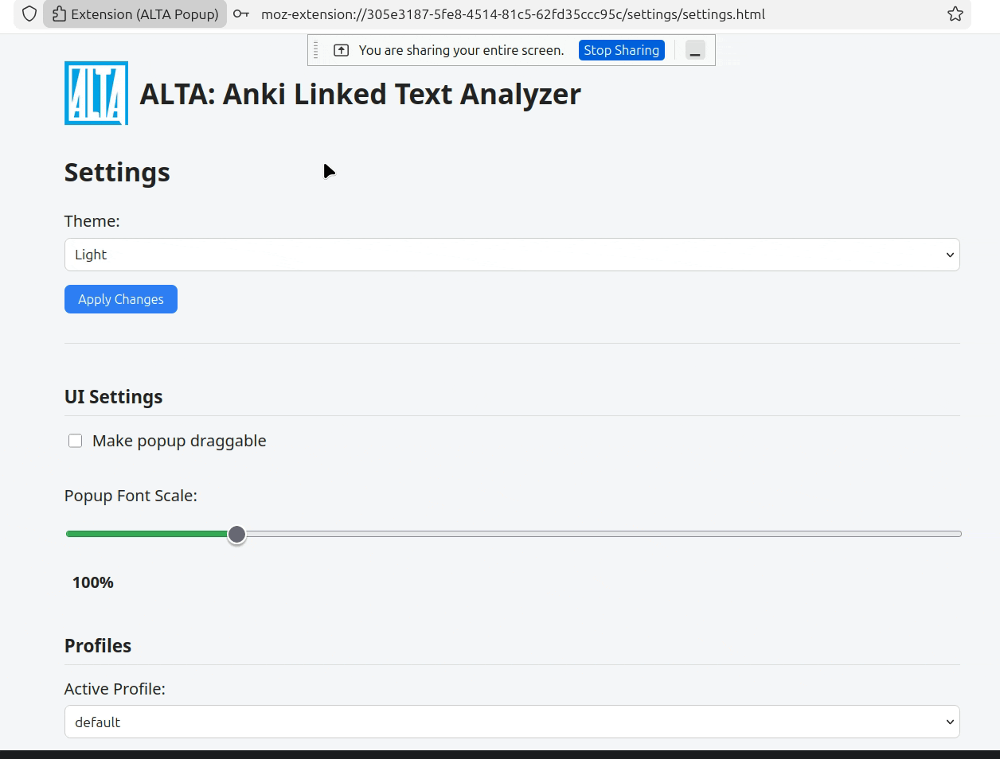
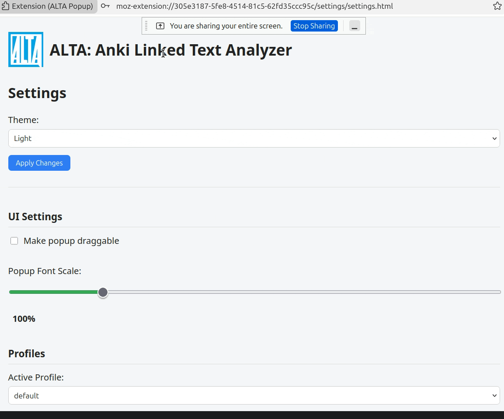
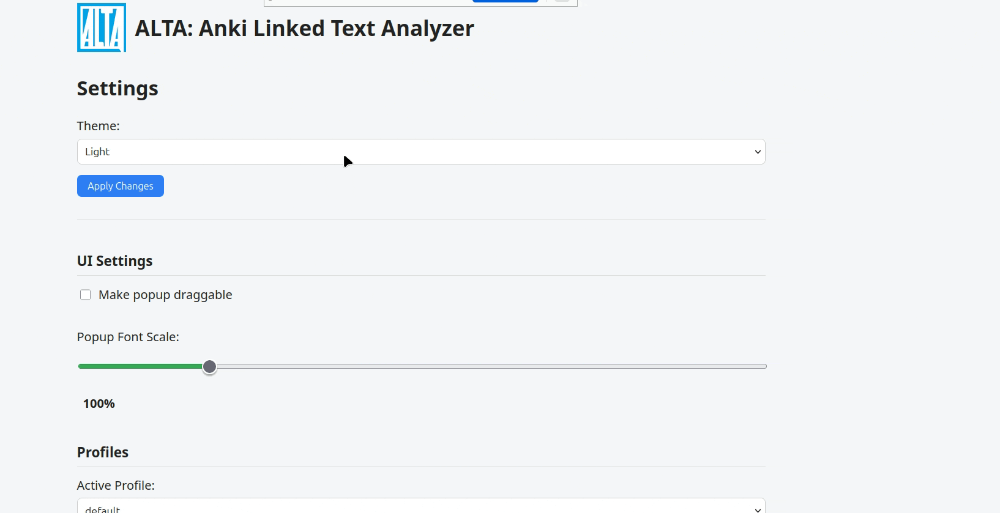

# ALTA – Anki Linked Text Analyzer

ALTA is a browser extension that analyzes selected text using AI and integrates the results directly into Anki. It is designed primarily for language learners but can also be used for general AI-assisted text processing.

This project was heavily inspired by Yomitan, and to a lesser extent Migaku, adapting the idea of seamless text lookup into a modern AI-driven, profile-based architecture.

The extension focuses on clean separation of concerns, modular configuration, and structured communication between browser UI, AI providers, and external systems.

---

## ✨ Features

- AI-powered text analysis from any webpage  
- Direct integration with Anki via AnkiConnect  
- Multiple independent user profiles  
- Advanced Anki field mapping  
- Local duplicate tracking system (FIFO-based)  
- Customizable popup behavior (theme, draggable, scaling)

---

## 🔍 Text Selection & AI Analysis

Users can select text on any webpage and trigger AI analysis through a configurable hotkey or context menu. The extension extracts the selected text and, optionally, its surrounding sentence to provide contextual information to the model.

The popup displays the AI response in real time. Communication with AI providers (OpenAI, Google Gemini, Groq) is routed through the background script, ensuring the content script remains focused on UI responsibilities.

Each profile can define its own provider, model, API key, and prompt template.

---

## 📚 One-Click Anki Integration

When enabled, ALTA connects to Anki through AnkiConnect. Decks and models are dynamically loaded from the local Anki instance. Model fields can be mapped to selected text, AI output, or context sentence.

Before enabling the “Add” button, the extension verifies connection status and checks for existing entries. A local FIFO-based database tracks previously added entries to provide immediate UI feedback independent of Anki’s internal duplicate handling.

The popup state updates instantly after adding a note.

---

## 👤 Profile System

ALTA supports multiple independent profiles. Each profile stores provider configuration, prompt template, hotkey, context behavior, and Anki settings.

Profiles are persisted using `browser.storage.local` and restored dynamically when switched. This enables separate workflows (e.g., different languages, decks, or models) without manual reconfiguration.

---

## 🎨 Customizable Popup UI

The popup supports light and dark themes, draggable positioning, and scalable font size (10%–500%). When draggable mode is enabled, the popup position persists across sessions.

UI settings are applied immediately, even while the popup is open, via storage change listeners that react to configuration updates in real time.

---

## 🏗 Architecture Overview

ALTA follows a layered architecture:

- **Content Script** – Handles selection detection, popup rendering, and UI interaction  
- **Background Script** – Central message router, AI provider communication, Anki integration, local duplicate database  
- **Settings Page** – Modular configuration system (profiles, providers, UI behavior)  
- **Local Storage** – Persistent state management  

Further architectural documentation will be expanded in future revisions.

---

## 🧠 Engineering Highlights

- Clear separation between UI layer and integration logic  
- Profile-aware configuration system with dynamic provider rendering  
- Persistent UI behavior with reactive updates via storage listeners  
- Independent local duplicate tracking mechanism (FIFO, capped size)  
- Structured message-based communication between content and background scripts  

---

## 🚀 Installation

1. Clone the repository.
2. Load as a temporary extension:
   - Firefox → `about:debugging` → “Load Temporary Add-on”
   - Chrome → `chrome://extensions` → Enable Developer Mode → “Load unpacked”
3. (Optional) Install Anki and the AnkiConnect add-on.
4. Configure your AI provider API key in the settings page.

---

## 📋 Requirements

- Firefox or Chromium-based browser  
- AI provider API key (OpenAI, Google Gemini, or Groq)  
- Anki + AnkiConnect (optional, required for flashcard integration)

---

## 📄 License

MIT License (see LICENSE file).
